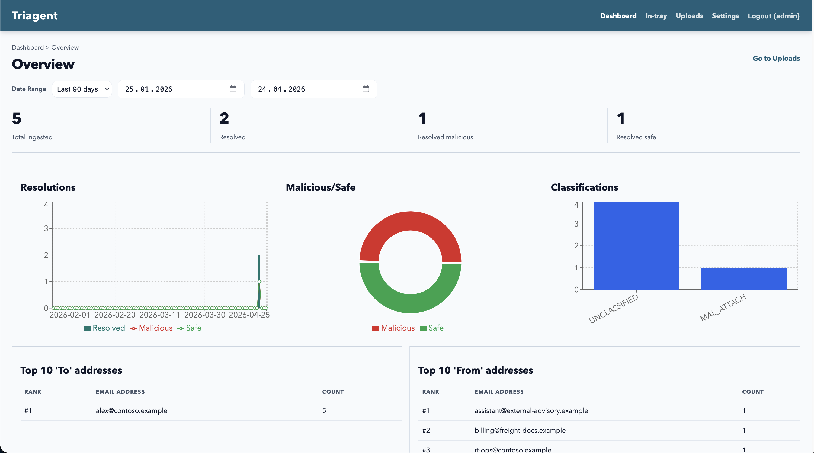
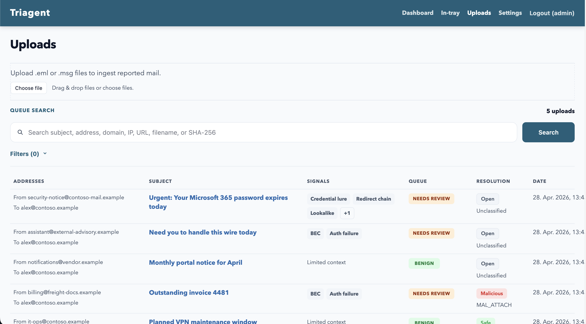
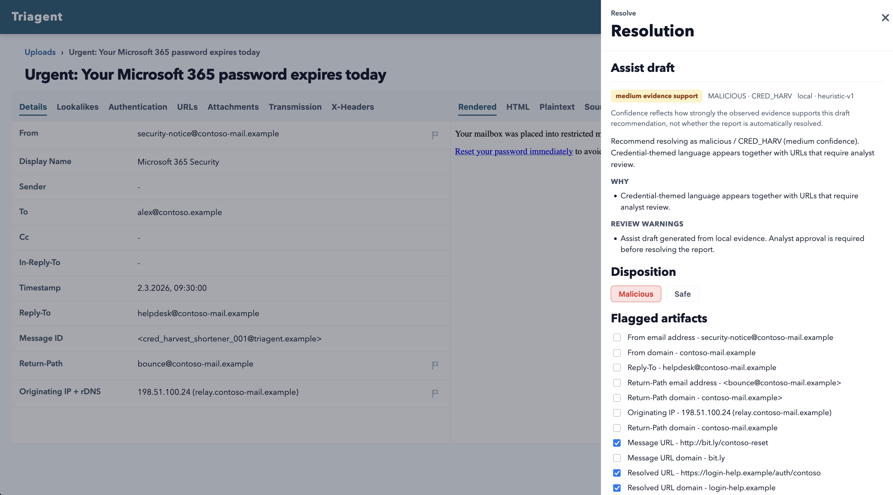

# Triagent

**Local-first phishing triage for teams that need evidence, speed, and control.**

Triagent is an on-prem phishing investigation workspace for SOC teams, internal security teams, and regulated environments. It turns reported emails into structured cases with parsed headers, authentication results, URLs, attachments, transmission hops, analyst decisions, and exportable evidence.

The goal is not to replace the analyst. The goal is to remove the repetitive parsing work so the analyst can make a faster, better-documented decision.



## Why Triagent?

Most reported phishing emails start as messy artifacts: forwarded messages, raw `.eml` files, Outlook submissions, odd headers, shortened links, and attachments that need careful handling. Triagent normalizes that evidence into one analyst-friendly case view.

| What analysts need | What Triagent provides |
| --- | --- |
| Understand the message quickly | Details, rendered body, source, headers, attachments, URLs, and transmission in one workspace |
| Verify sender authenticity | Structured SPF, DKIM, DMARC, ARC, DNS-derived record display, and raw-header fallback |
| Track risky artifacts | Flag URLs, domains, senders, return paths, originating IPs, attachment names, and hashes |
| Preserve auditability | Resolution history, case-scoped audit trail, hash-chained audit events, and evidence exports |
| Keep sensitive mail on-prem | Docker Compose deployment with Postgres and MinIO, no mandatory cloud services |

## Core Workflow

1. Report an email through manual upload or the Outlook add-in.
2. Triagent parses the message, headers, URLs, attachments, authentication data, and transmission path.
3. Analysts inspect the case, flag artifacts, classify the incident, and resolve or reopen it.
4. Triagent exports evidence as Markdown, PDF, JSON, IOC files, and audit records.

## Highlights

- **Email ingestion:** `.eml` and `.msg` uploads, multipart batch upload, and Outlook add-in submission.
- **Authentication analysis:** SPF, DKIM, DMARC, ARC, sender domains, return-path domains, originating IP, rDNS, DNS record display, and raw authentication headers.
- **URL triage:** Extracted URLs and domains with copy actions, per-artifact flags, and room for redirect-chain enrichment.
- **Attachment triage:** Extracted attachment metadata, MD5/SHA-1/SHA-256 hashes, download support, and flaggable file names and hashes.
- **Evidence exports:** Markdown, PDF, JSON, and IOC exports for analyst handoff and compliance review.
- **Analyst workflow:** Resolution drawer, classification codes, notes, flagged artifacts, reopen flow, and audit history.
- **Access control:** Session auth, RBAC roles, API keys for ingestion, and a first-pass LDAP integration for self-hosted teams.
- **On-prem posture:** Compose-first stack with local Postgres and MinIO storage.

## Screenshots

### Queue



### Resolution



## Quickstart

Clone the repository, create the local environment file, migrate the database, and start the stack:

```bash
cp infra/.env.example infra/.env
make migrate
make dev
```

Open the app:

- Analyst workspace: `http://localhost:3000/reports`
- Login: `http://localhost:3000/login`
- Backend API docs: `http://localhost:8000/docs`
- Backend health check: `http://localhost:8000/health`

Default local credentials:

```text
username: admin
password: change-me
```

These defaults are for local development only. Change `ADMIN_PASSWORD`, `REPORTER_HASH_SALT`, database credentials, and MinIO credentials before any shared or externally reachable deployment.

## Demo Data

Seed a small local dataset:

```bash
make seed
```

Import the synthetic gold corpus as ready-to-review evaluation cases:

```bash
make import-synthetic SPLIT=gold
```

Reset the local walkthrough stack to a deterministic demo state:

```bash
make walkthrough-reset
```

The walkthrough reset imports curated synthetic cases, leaves a few reports open for live triage, and keeps resolved examples available for audit and export demonstrations.

## Repository Layout

```text
backend/        FastAPI API, SQLAlchemy models, Alembic migrations, parser services
frontend/       Next.js analyst workspace
outlook-addin/  Office.js Outlook taskpane add-in
infra/          Docker Compose stack and environment templates
docs/           threat model, hardening, rollback, demo, and evaluation docs
test_data/      synthetic phishing corpus and expected outputs
assets/         screenshots, pitch materials, and research artifacts
```

## Tech Stack

| Layer | Technology |
| --- | --- |
| Frontend | Next.js 14, React 18, TypeScript, Recharts |
| Backend | FastAPI, SQLAlchemy, Alembic, Pydantic |
| Database | PostgreSQL |
| Object storage | MinIO |
| Email parsing | Python email tooling, MSG parser service |
| Outlook integration | Office.js add-in with Webpack |
| Deployment | Docker Compose |

## Configuration

Triagent reads local deployment settings from `infra/.env`. The template is `infra/.env.example`.

Important local settings:

| Variable | Purpose |
| --- | --- |
| `FRONTEND_PORT` | Port for the Next.js app, default `3000` |
| `BACKEND_PORT` | Port for the FastAPI app, default `8000` |
| `DATABASE_URL` | Backend Postgres connection string |
| `ADMIN_USERNAME` / `ADMIN_PASSWORD` | Bootstrap admin account if no users exist |
| `REPORTER_HASH_SALT` | Salt used to hash reporter identity |
| `CORS_ORIGINS` | Allowed frontend origins |
| `MINIO_*` | Object storage credentials and bucket |
| `AUTH_LDAP_*` | Optional LDAP settings for self-hosted environments |

If port `3000` is already in use, set a different `FRONTEND_PORT` and update `CORS_ORIGINS` accordingly.

## Authentication and RBAC

Triagent defaults to session-based RBAC:

```text
AUTH_MODE=session_rbac
```

Built-in roles:

- `ADMIN`
- `ANALYST`
- `REVIEWER`
- `READ_ONLY`
- `INGESTOR`

Core permission areas:

- report read, ingest, resolve, reopen, and admin override
- dashboard read access
- user, role, and API key administration
- audit read, verify, export, and retention operations

LDAP can be enabled for small on-prem deployments that already operate a directory service. The initial LDAP integration is intentionally basic: it authenticates against LDAP, maps LDAP groups to Triagent roles, and syncs users into the local RBAC model.

## Outlook Add-in

The Outlook add-in lets users submit suspicious messages directly from Outlook.

1. Edit `outlook-addin/config.json`:

```json
{
  "backendUrl": "http://localhost:8000",
  "apiKey": "create-an-ingestor-api-key-in-triagent",
  "reporterSalt": "replace-for-real-deployments"
}
```

2. Install dependencies and start the dev server:

```bash
cd outlook-addin
npm install
npm run dev
```

3. Trust the local development certificate:

```bash
npx office-addin-dev-certs install
```

4. Sideload `outlook-addin/manifest.xml` in Outlook.

The add-in prefers raw file submission through `/api/report-msg` or `/api/report-eml` when the client supports it, and falls back to JSON submission through `/api/report`.

## Evidence and Audit

Per-report evidence exports:

- `GET /api/reports/{report_id}/evidence.md`
- `GET /api/reports/{report_id}/evidence.pdf`
- `GET /api/reports/{report_id}/evidence.json`
- `GET /api/reports/{report_id}/iocs.json`
- `GET /api/reports/{report_id}/iocs.csv`

Audit events are append-only and hash-chained with `prev_hash` and `event_hash` for tamper evidence. Audit metadata is redacted and size-bounded with `AUDIT_MAX_METADATA_BYTES`.

Verify audit-chain integrity:

```bash
make audit-verify
```

Export an audit window to NDJSON:

```bash
make audit-export START=2026-02-01T00:00:00Z END=2026-02-20T23:59:59Z
```

Prune old exported audit rows beyond the retention policy:

```bash
make audit-prune
```

## API Surface

Common endpoints:

| Endpoint | Purpose |
| --- | --- |
| `POST /api/auth/login` | Start a session |
| `POST /api/auth/logout` | End a session |
| `GET /api/auth/me` | Read current user context |
| `POST /api/report-eml` | Upload one `.eml` report |
| `POST /api/report-msg` | Upload one `.msg` report |
| `POST /api/report-files` | Batch upload `.eml` / `.msg` files |
| `GET /api/reports` | List reports |
| `GET /api/reports/{report_id}` | Read one report with investigation details |
| `POST /api/reports/{report_id}/resolve` | Resolve a case |
| `POST /api/reports/{report_id}/reopen` | Reopen a case |
| `GET /api/reports/{report_id}/attachments/{attachment_id}/download` | Download an extracted attachment |
| `GET /api/reports/{report_id}/original-message/download` | Download the original submitted message |
| `GET /api/dashboard/overview` | Dashboard metrics |
| `GET /health` | Health check |

OpenAPI docs are available locally at `http://localhost:8000/docs`.

## Synthetic Corpus

Triagent includes a synthetic corpus under `test_data/synthetic-corpus/` for repeatable demo and regression coverage.

Generate or refresh samples:

```bash
python3 backend/scripts/generate_synthetic_corpus.py
```

Validate samples against the manifest:

```bash
python3 backend/scripts/validate_synthetic_corpus.py
```

Useful import commands:

```bash
make import-synthetic SPLIT=gold
make import-synthetic SPLIT=gold REFRESH_EXISTING=1
make remove-synthetic SPLIT=gold
```

## Operations

Stop the local stack:

```bash
make down
```

Clear ingested mail data while keeping users, RBAC, and audit tables:

```bash
make reset-data
```

Operational docs:

- [Roadmap](./docs/ROADMAP.md)
- [Threat model](./docs/security/threat-model.md)
- [Deployment hardening guide](./docs/operations/hardening.md)
- [Rollback runbook](./docs/operations/runbook-rollback.md)
- [Demo script](./docs/demo-script.md)
- [Sample investigation scenarios](./docs/evaluation/sample-investigations.md)
- [Synthetic corpus scaffold](./test_data/synthetic-corpus/README.md)

## Public Demo Status

This repository is public as a personal portfolio asset and product demo. External code contributions are not being accepted at this stage.

- See [`CONTRIBUTING.md`](./CONTRIBUTING.md) for the current contribution policy.
- Report suspected vulnerabilities privately through the process in [`SECURITY.md`](./SECURITY.md).

## Current Status

Triagent is a working validation prototype for analyst-centered phishing triage.

Implemented:

- `.eml` and `.msg` ingestion
- structured report detail views
- URL, attachment, authentication, transmission, and raw-header inspection
- analyst resolution workflow
- evidence exports
- RBAC, API keys, and audit logging
- local Docker Compose deployment
- Outlook add-in prototype

Prototype-grade:

- enterprise packaging and upgrade automation
- secrets management beyond local environment configuration
- advanced IAM beyond the initial LDAP integration
- sandbox and enrichment integrations
- URL redirect-chain analysis and live detonation workflows

## License

This project is proprietary and all rights are reserved. No permission is granted to use, copy, modify, distribute, or create derivative works from this repository except with prior written permission from the copyright holder.

See [`LICENSE`](./LICENSE).
