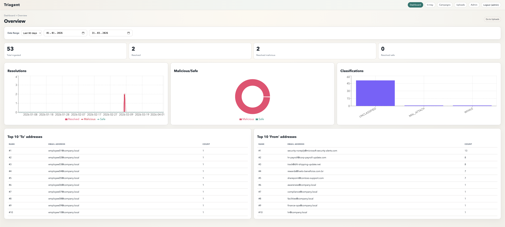

# Triagent

AI-assisted, on-prem phishing triage for regulated environments.

Triagent helps SOC teams prioritize the right cases instead of reviewing every reported email in isolation. It surfaces the highest-risk cases first, keeps analysts in the loop for resolution, and generates evidence-first reports with a complete audit trail.

Core workflow:
- Ingest reported emails from manual uploads or the Outlook add-in
- Normalize headers, URLs, attachments, and message metadata
- Let analysts review and resolve reported emails with full context
- Export evidence reports and compliance-friendly audit history



## Repo Structure

- `backend/`: FastAPI API + SQLAlchemy + Alembic
- `frontend/`: Next.js analyst workspace (uploads, in-tray, dashboard, admin)
- `outlook-addin/`: Office.js taskpane add-in
- `infra/`: Docker Compose + env templates

## Quickstart (Local)

1) Copy env template:

```bash
cp infra/.env.example infra/.env
```

The default local ports are controlled by:
- `FRONTEND_PORT` (default `3000`)
- `BACKEND_PORT` (default `8000`)

2) Run migrations:

```bash
make migrate
```

3) Start services:

```bash
make dev
```

4) (Optional) Seed demo data:

```bash
make seed
```

Open:
- Dashboard: `http://localhost:${FRONTEND_PORT}` (default `http://localhost:3000`)
- Login: `http://localhost:${FRONTEND_PORT}/login`
- Backend docs: `http://localhost:${BACKEND_PORT}/docs` (default `http://localhost:8000/docs`)
- Backend health: `http://localhost:${BACKEND_PORT}/health`

If port `3000` is already in use, set a different `FRONTEND_PORT` in `infra/.env` and update `CORS_ORIGINS` accordingly.

## Development Defaults

This repository ships with local-development defaults for convenience:

- `ADMIN_USERNAME=admin`
- `ADMIN_PASSWORD=change-me`
- `MINIO_ROOT_USER=minioadmin`
- `MINIO_ROOT_PASSWORD=minioadmin`
- `REPORTER_HASH_SALT=change-me`

These are demo defaults only. Change them before any shared, persistent, or externally reachable deployment.

## Product Positioning

Triagent is designed around analyst-centered phishing triage:

- AI-assisted scoring to prioritize suspicious emails
- Rich email inspection across details, authentication, URLs, attachments, transmission, and raw headers
- Analyst-in-the-loop resolution workflows
- Automated evidence reports with artifacts, rationale, and audit history
- On-prem deployment for regulated and sensitive environments

The goal is not blind automation. The goal is faster, more consistent analyst decisions with full traceability.

## Public Demo Scope

This public repository is intended as a working validation demo for phishing triage.

Implemented in the public demo:
- `.eml` and `.msg` ingestion
- report evidence export
- analyst resolution workflow
- RBAC and tamper-evident audit logging
- Docker-based local deployment

Still demo-grade / not production-complete:
- deployment is Compose-first, not enterprise packaging
- secrets management is local-config based
- external integrations and enterprise SSO are not the focus of this repo
- sample datasets and workflows are designed to demonstrate the concept clearly

## Authentication and RBAC

- Auth mode defaults to `session_rbac`.
- On backend startup, if no users exist and `ADMIN_USERNAME` / `ADMIN_PASSWORD` are set, an initial admin user is bootstrapped.
- Login at `http://localhost:${FRONTEND_PORT}/login` using that admin user.
- Legacy basic-auth bridge can be enabled/disabled with `AUTH_LEGACY_BASIC_ENABLED`.

### Core permissions

- `reports.read`, `reports.ingest`, `reports.resolve`, `reports.reopen`, `reports.admin_override`
- `resolutions.read`, `dashboard.read`
- `admin.users.read`, `admin.users.write`, `admin.roles.read`, `admin.api_keys.manage`
- `audit.read`, `audit.export`, `audit.verify`, `audit.archive.manage`

### Built-in roles

- `ADMIN`, `ANALYST`, `REVIEWER`, `READ_ONLY`, `INGESTOR`

## Outlook Add-in (Sideload)

1) Update backend URL and API key:

- Edit `outlook-addin/config.json`
  - `backendUrl`
  - `apiKey` (create one from Admin -> API Keys, role `INGESTOR`)
  - `reporterSalt` is a local demo placeholder and should be replaced outside throwaway development environments
  - Add-in prefers raw file submission when supported (`/api/report-msg` for MSG, `/api/report-eml` for EML), and falls back to JSON `/api/report` if raw file APIs are unavailable in the client.

2) Install add-in deps and start dev server:

```bash
cd outlook-addin
npm install
npm run dev
```

3) Trust dev certificate (first time):

```bash
npx office-addin-dev-certs install
```

4) Sideload `outlook-addin/manifest.xml`:

- **Windows (Outlook Desktop)**: File -> Manage Add-ins -> Upload My Add-in -> select the manifest.
- **macOS (Outlook Desktop)**: Tools -> Accounts -> Advanced -> Custom Add-ins -> "+" -> add manifest.
- **Outlook on the web**: Settings -> Manage add-ins -> Upload custom add-in.

## Demo Flow

1) Login in the UI.
2) Upload one or more `.eml` or `.msg` files from Uploads, or ingest through the add-in.
3) Open a report, inspect details, authentication, URLs, attachments, transmission, and raw source.
4) Resolve or reopen with analyst notes, classification, flagged artifacts, and audit history.
5) Export report evidence as Markdown or PDF.
6) Review dashboard metrics and admin/audit pages.

## API (Backend)

### Auth

- `POST /api/auth/login`
- `POST /api/auth/logout`
- `GET /api/auth/me`

### Admin

- `GET /api/admin/roles`
- `GET /api/admin/permissions`
- `GET /api/admin/users`
- `POST /api/admin/users`
- `PATCH /api/admin/users/{user_id}`
- `PUT /api/admin/users/{user_id}/roles`
- `POST /api/admin/api-keys`
- `GET /api/admin/api-keys`
- `POST /api/admin/api-keys/{id}/revoke`
- `GET /api/admin/audit/events`
- `GET /api/admin/audit/events/{event_id}`
- `GET /api/admin/audit/verify`
- `GET /api/admin/audit/export.ndjson`
- `GET /api/admin/audit/exports`

### Reports and dashboard

- `POST /api/report`
- `POST /api/report-eml` (multipart `.eml` upload)
- `POST /api/report-msg` (multipart `.msg` upload)
- `POST /api/report-files` (multipart batch upload for `.eml`/`.msg`, partial success)
- `GET /api/reports`
- `GET /api/reports/{report_id}`
- `GET /api/reports/{report_id}/attachments`
- `GET /api/reports/{report_id}/evidence.md`
- `GET /api/reports/{report_id}/evidence.pdf`
- `PATCH /api/reports/{report_id}` (admin override)
- `POST /api/reports/{report_id}/resolve`
- `POST /api/reports/{report_id}/reopen`
- `GET /api/reports/{report_id}/resolutions`
- `GET /api/dashboard/overview?start=<ISO>&end=<ISO>&tz=<IANA>`
- `GET /api/reports/stats`
- `GET /health`

## Notes

- Reporter identity is hashed with `REPORTER_HASH_SALT`.
- `.msg` uploads extract attachments, compute SHA-256, and store blobs in MinIO with metadata in `attachments`.
- Case evidence export is available per report in Markdown and PDF, including artifacts, rationale, resolution history, and case-scoped audit trail.
- Audit events are append-only and hash-chained (`prev_hash`, `event_hash`) for tamper evidence.
- Audit metadata is redacted and size-bounded (`AUDIT_MAX_METADATA_BYTES`) to avoid logging secrets.

## Audit Operations

- Verify chain integrity:

```bash
make audit-verify
```

- Export a window to NDJSON and persist export manifest:

```bash
make audit-export START=2026-02-01T00:00:00Z END=2026-02-20T23:59:59Z
```

- Prune old exported rows beyond retention policy:

```bash
make audit-prune
```

## Maintenance

- Clear only ingested mail data (keeps users/RBAC/audit tables):

```bash
make reset-data
```

- Relevant env vars:
  - `AUDIT_RETENTION_DAYS`
  - `AUDIT_EXPORT_ENABLED`
  - `AUDIT_EXPORT_STORAGE` (`filesystem` or `minio`)
  - `AUDIT_EXPORT_BUCKET`, `AUDIT_EXPORT_PATH`
  - `AUDIT_MAX_METADATA_BYTES`

## License

This project is licensed under the MIT License. See [`LICENSE`](./LICENSE).
